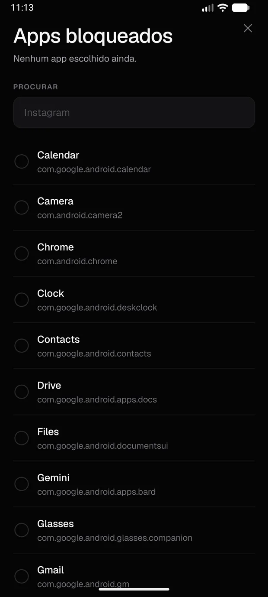

# Matheus Beiruth

Desenvolvedor back-end com foco em Python. Construo APIs, sistemas orientados a eventos e, agora, aplicações com LLM.

📍 Maricá, RJ · [LinkedIn](https://linkedin.com/in/matheusbeiruth) · matheusbeiruth10@gmail.com

## Agora

- Estudando LLMs, RAG, agentes e Model Context Protocol (MCP)
- Próximo projeto: um sistema de **RAG** com FastAPI, PostgreSQL/pgvector e avaliação de qualidade

## Stack

### Back-End e Full Stack

### Dados e Infraestrutura

## Projetos em Destaque

### [Trackio](https://github.com/BeiruthDEV/TaskManagerAPI)
API de gestão de tarefas em monólito modular (ports/adapters), com Kanban, dashboard, 55 testes automatizados (unitários, integração e BDD), CI e deploy.

  

`Java 17` `Spring Boot 3` `Spring Data JPA` `PostgreSQL` `Docker` `Cucumber`

### [TransFlow](https://github.com/BeiruthDEV/transflow-backend)
API de mobilidade orientada a eventos: registra corridas, publica eventos no RabbitMQ e um worker atualiza o saldo do motorista de forma atômica no Redis.

  

`Python` `FastAPI` `RabbitMQ` `Redis` `MongoDB` `Docker`

### [Gestão Ativa](https://github.com/BeiruthDEV/gestao-ativa-demo)
SaaS de finanças pessoais com dashboard, leitura de extratos em PDF/CSV, categorização automática de transações e detecção de recorrências.

  
  

`Next.js` `FastAPI` `Python` `Pandas` `SaaS`

### [StayOn](https://github.com/BeiruthDEV/StayOn)
App Android de foco e produtividade, offline e sem conta: tarefas, hábitos, agenda em blocos e sessões de foco com bloqueio de apps via módulo nativo em Kotlin.

  
  

`React Native` `Expo` `TypeScript` `Kotlin`

### [Orbia](https://github.com/BeiruthDEV/Orbia)
Sistema web em Django para gestão de empresas, representantes, projetos e pesquisas, com mapas, dashboards e permissões por tipo de usuário.

  

`Django` `Python` `PostgreSQL` `Leaflet` `Autenticação`

## Currículo

📄 [Baixar currículo (PDF)](./assets/CV_Matheus_Beiruth_BackEnd_2026.pdf)
