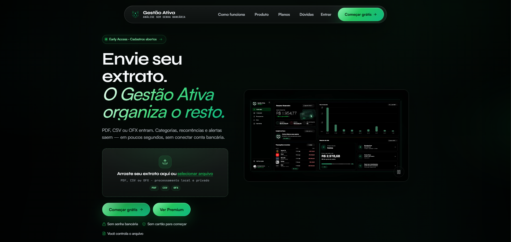
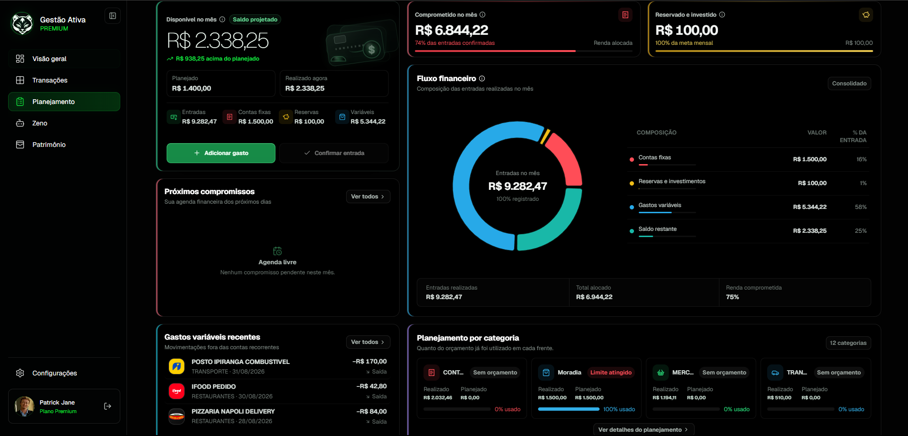
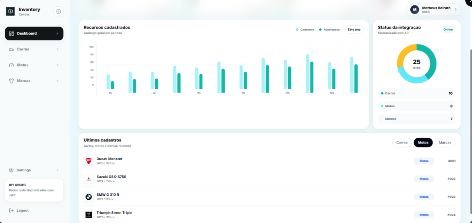
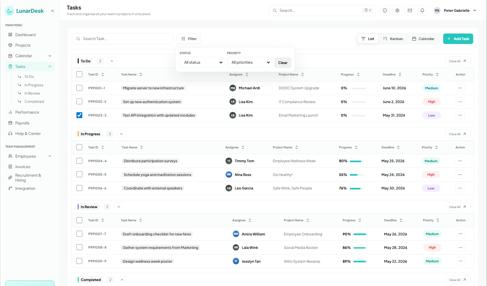

 
 

<a href="https://www.linkedin.com/in/matheusbeiruth">LinkedIn</a> |
<a href="mailto:matheusbeiruth10@gmail.com">Email</a> |
<a href="https://beiruthdev.github.io/">Portfolio</a>

---

## Perfil

Sou estudante de Engenharia de Software com foco em **backend, arquitetura de APIs e sistemas escalaveis**. Trabalho principalmente com **Python, FastAPI, Django, Java e Docker**, e venho ampliando meu escopo para produtos **full stack** com **Next.js, React e TypeScript**.

Meu interesse esta em construir software com base tecnica forte: dominio bem modelado, integracoes claras, regras de negocio consistentes e uma estrutura que continue fazendo sentido quando o projeto cresce.

## Foco Atual

- APIs REST, autenticacao, mensageria e integracoes entre servicos
- Modelagem de sistemas, arquitetura orientada a eventos e performance
- Produtos SaaS, dashboards, e-commerces e plataformas web com cara de produto real

---

## Stack

### Back-End e Full Stack

  

### Dados e Infraestrutura

  

---

## Projetos em Destaque

### [gestao-ativa-demo](https://github.com/BeiruthDEV/gestao-ativa-demo)
SaaS de financas pessoais com dashboard, parsing de PDF/CSV, categorizacao automatica de transacoes e deteccao de recorrencias.

  
  

`Next.js` `FastAPI` `Python` `SaaS`

### [express-jwt-docker-api](https://github.com/BeiruthDEV/express-jwt-docker-api)
API REST de catalogo de veiculos (carros, motos e marcas) construida com Express e autenticacao JWT, empacotada com Docker para deploy simples. Acompanha um dashboard que consome os dados reais da API.

  

`Node.js` `Express` `JWT` `Docker`

### [Orbia](https://github.com/BeiruthDEV/Orbia)
Sistema web em Django para gestao de empresas, representantes, projetos e pesquisas, com autenticacao e permissoes por tipo de usuario.

  

`Django` `Python` `Sistema web` `Autenticacao`

### [TaskManagerAPI](https://github.com/BeiruthDEV/TaskManagerAPI)
API REST para gerenciamento de tarefas, criada com Spring Boot 3, Spring Data JPA e H2 Database.

  

`Java 17+` `Spring Boot 3` `H2 Database` `OpenAPI / Swagger` `Spring Data JPA`

---

## Recursos

- [CV em Portugues](./assets/CV_Matheus_Beiruth_FullStack_2026.pdf)
- [CV in English](./assets/CV_Matheus_Beiruth_FullStack_EN.pdf)

---

## Estatisticas

  
  

  

---

> "Primeiro, resolva o problema. Depois, escreva o codigo."

